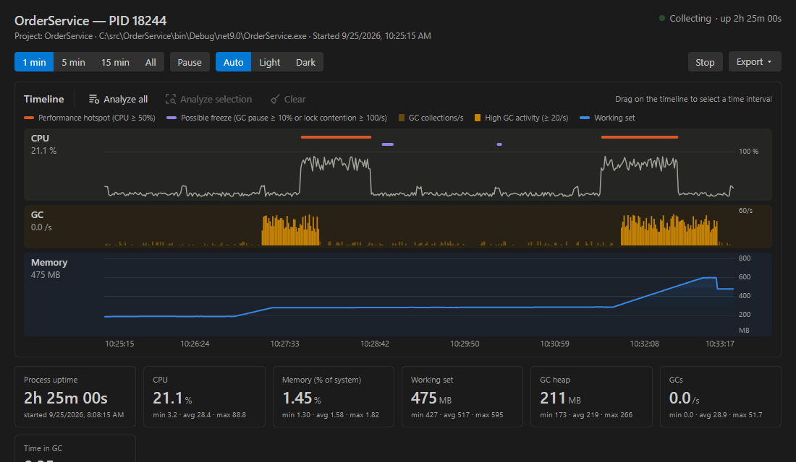
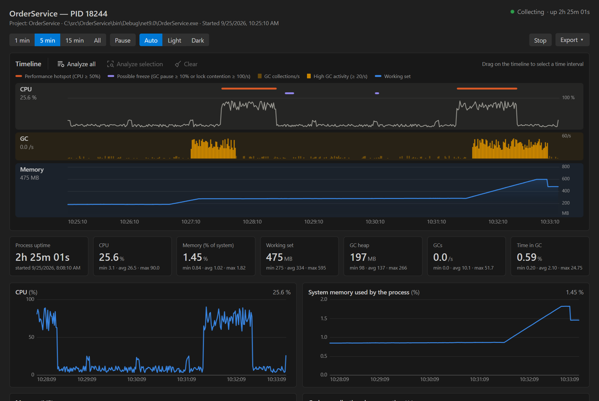
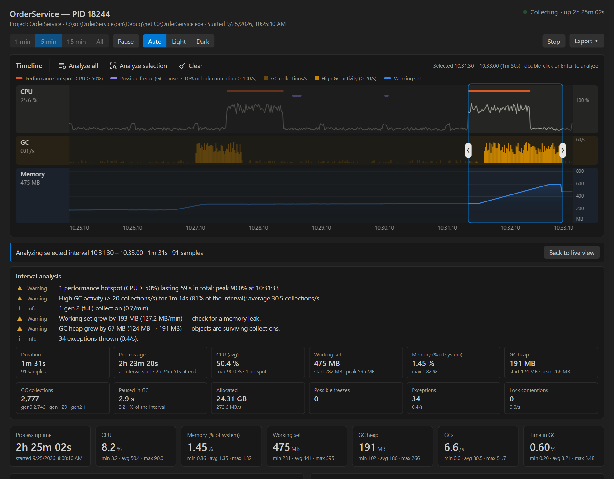
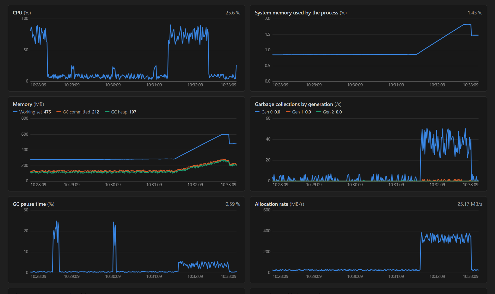
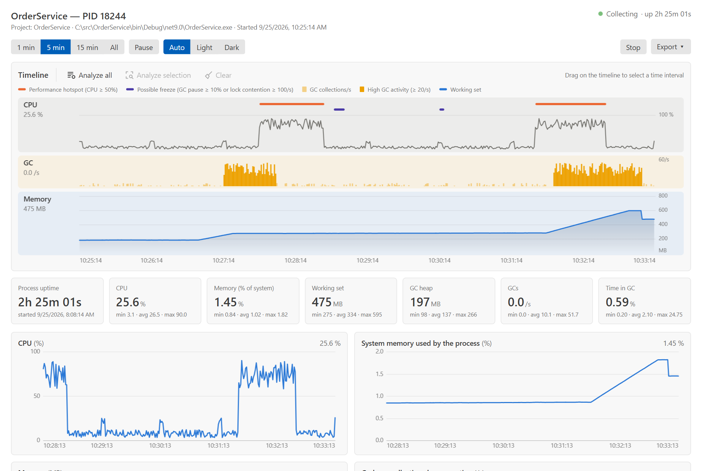

# .NET Counters Dashboard

Real-time performance monitoring for .NET applications, inside Visual Studio Code.

.NET Counters Dashboard runs [`dotnet-counters`](https://learn.microsoft.com/dotnet/core/diagnostics/dotnet-counters) for you and turns its output into an interactive dashboard: CPU, memory, garbage collection, allocation rate, thread pool, exceptions and lock contention, shown as a session timeline with automatic detection of performance hotspots, possible freezes and high GC activity. Select any time interval to get a summary and findings for it, export the data, and import it again later.

It can also watch the projects in your workspace and start monitoring automatically every time their process starts.



## Features

- **Session timeline.** CPU, GC and memory lanes on a shared time axis, covering the whole session. Marker rows highlight performance hotspots and possible freezes; GC bars are emphasized where collection activity is high.
- **Time-interval analysis.** Drag on the timeline to select an interval, then analyze it. You get automatic findings (hotspots, freezes, sustained GC pressure, gen 2 collections, memory growth, exceptions) and a summary: duration, CPU average and peak, working set and GC heap at start and peak, collections per generation, time paused in GC, total allocated memory and more.
- **Detailed charts.** CPU, system memory share, working set / GC heap / GC committed, collections per generation, GC pause time, allocation rate, thread pool and exceptions, each with hover inspection and a 1 min, 5 min, 15 min or full-session window.
- **All counters.** A filterable table with the latest value of every counter the runtime publishes.
- **Project-aware.** Finds the process of a workspace project by its `AssemblyName` or project name, and waits for it to start if it is not running yet.
- **Watched projects.** Saves the projects you want to monitor per workspace and attaches automatically on every run, for example on each debug session or `dotnet run`.
- **Process uptime.** Shows how long the monitored process has been running, in the process list, the dashboard and the status bar.
- **Export and import.** CSV (normalized metrics), JSON (metrics, counters and analysis), raw `dotnet-counters` CSV and PNG. Exports can be limited to the selected interval. Exported files, and CSV files recorded directly with `dotnet-counters`, can be imported and explored in the same dashboard.
- **Theme support.** Follows the VS Code theme, or can be set to light or dark. Chart colors are chosen to remain distinguishable for common forms of color vision deficiency.



## Requirements

- Visual Studio Code 1.85 or later.
- The [.NET SDK](https://dotnet.microsoft.com/download).
- The `dotnet-counters` global tool:

  ```shell
  dotnet tool install --global dotnet-counters
  ```

  If the tool cannot be found, the extension offers to install it.

The monitored application can target any .NET version supported by `dotnet-counters` (.NET Core 3.1 and later). Both the event counters used up to .NET 8 and the `System.Diagnostics.Metrics` instruments used by .NET 9 and later are supported.

## Getting started

1. Open the **.NET Counters** view from the activity bar.
2. Start monitoring in one of the following ways:
   - Select a process in the **.NET Processes** view. Processes that belong to projects in the current workspace are listed first.
   - Run **.NET Counters: Monitor Workspace Project** to pick a project from the workspace. If its process is not running, the extension waits for it to start.
   - Run **.NET Counters: Watch Project…** to monitor a project automatically whenever it runs.
3. The dashboard opens and starts updating.

## Using the dashboard

### Timeline

The timeline spans the whole session and has three lanes:

| Lane | Content |
|---|---|
| CPU | Process CPU usage, with marker rows for performance hotspots and possible freezes. |
| GC | Garbage collections per second. Bars are emphasized where GC activity is high. |
| Memory | Working set, with the scale on the right-hand side. |

An event is marked when a sample crosses the configured threshold:

| Event | Default condition | Setting |
|---|---|---|
| Performance hotspot | CPU at or above 50% | `dotnetCounters.hotspotCpuPercent` |
| Possible freeze | Time paused in GC at or above 10%, or at least 100 lock contentions per second | `dotnetCounters.freezeGcPausePercent`, `dotnetCounters.freezeLockContentionsPerSecond` |
| High GC activity | At least 20 collections per second, all generations | `dotnetCounters.highGcCollectionsPerSecond` |

### Analyzing a time interval



- Drag across the timeline to select an interval. Use the handles to resize it, drag inside it to move it, and click outside it or press Escape to clear it.
- Select **Analyze selection**, double-click the selection or press Enter to analyze it. The stat tiles and charts switch to that interval.
- Select **Analyze all** to analyze the entire session. The analysis keeps updating while data is collected.
- Select **Back to live view** to return to the live window.

### Charts

Below the timeline, stat tiles show the current value together with the minimum, average and maximum over the visible window, followed by detailed charts for each metric. Hover over a chart to inspect individual samples.



The dashboard follows the VS Code color theme by default. Use the Auto, Light and Dark buttons, or the `dotnetCounters.theme` setting, to choose a theme explicitly.



### Exporting data

Use **Export** in the dashboard, or **Export Data…** on a session in the **Monitoring Sessions** view. When an interval is selected or analyzed, dashboard exports are limited to it, and the export menu shows the current scope.

| Format | Content |
|---|---|
| CSV, normalized metrics | One row per sample with CPU, memory, GC, allocation, thread pool and exception metrics. |
| JSON | Process information, all samples, the latest value of every counter and, when available, the interval analysis. |
| Raw CSV | The unmodified `dotnet-counters` output, with every counter and every sample. |
| PNG | The timeline and all charts as a single image. |

### Importing data

Run **.NET Counters: Import Data…**, use the import action in the **Monitoring Sessions** or **.NET Processes** view, or right-click a `.csv` or `.json` file in the Explorer. Supported files:

- Raw CSV exported by the extension, or recorded directly with `dotnet-counters collect --format csv`. The date format of the file is detected automatically.
- Normalized CSV exported by the extension.
- JSON exported by the extension.

Imported data opens as a read-only session with the same timeline, analysis, charts and export options. Several files can be imported at once.

## Watched projects

The **Watched Projects** view keeps a list of projects to monitor. The list is stored per workspace and restored when VS Code starts.

For each watched project, the extension looks for its process in `dotnet-counters ps` at a regular interval. When the process starts, the extension attaches to it and opens the dashboard without taking focus. When the process exits, the extension waits for the next start. The dashboard of a new run replaces the one of the previous run; earlier runs remain available in **Monitoring Sessions**.

| State | Meaning |
|---|---|
| Waiting for process | The project is not running; the extension attaches as soon as it starts. |
| Monitoring PID *n* | A session is collecting data for the running process. |
| Stopped by you | The session was stopped manually. That process is not attached again; the next start is. |
| Paused | The project is not being watched until it is resumed. |

Projects can be added from **Watch Project…**, from the watch action on a process in **.NET Processes**, or from the **Keep watching** option offered when **Monitor Workspace Project** does not find a running process.

## Commands

| Command | Description |
|---|---|
| .NET Counters: Monitor Workspace Project | Monitor a project from the current workspace, waiting for its process if needed. |
| .NET Counters: Monitor by Process Name… | Monitor a process by name. |
| .NET Counters: Watch Project… | Add projects to the watched list. |
| .NET Counters: Import Data… | Open exported or recorded counter data in the dashboard. |
| .NET Counters: Refresh Processes | Refresh the list of .NET processes. |

Session and watch actions (open, stop, export, remove, pause, resume, stop watching) are available from the corresponding items in the views.

## Settings

| Setting | Default | Description |
|---|---|---|
| `dotnetCounters.toolPath` | `dotnet-counters` | Path to the `dotnet-counters` executable. By default the tool is looked up in `PATH` and in the .NET global tools folder. |
| `dotnetCounters.counters` | `System.Runtime` | Providers and counters passed to `--counters`, for example `System.Runtime,Microsoft.AspNetCore.Hosting`. |
| `dotnetCounters.refreshInterval` | `1` | Sampling interval, in seconds. |
| `dotnetCounters.projectName` | *(empty)* | Process name to monitor. When empty, the workspace project files are used. |
| `dotnetCounters.waitForProcessSeconds` | `60` | How long Monitor Workspace Project waits for the process to start. |
| `dotnetCounters.watchPollSeconds` | `3` | How often watched projects are looked up, in seconds. |
| `dotnetCounters.watchOpenDashboard` | `true` | Open the dashboard automatically when a watched project starts. |
| `dotnetCounters.theme` | `auto` | Dashboard theme: `auto`, `light` or `dark`. |
| `dotnetCounters.hotspotCpuPercent` | `50` | CPU percentage that marks a performance hotspot. |
| `dotnetCounters.freezeGcPausePercent` | `10` | Percentage of time paused in GC that marks a possible freeze. |
| `dotnetCounters.freezeLockContentionsPerSecond` | `100` | Lock contentions per second that mark a possible freeze. |
| `dotnetCounters.highGcCollectionsPerSecond` | `20` | Collections per second that mark high GC activity. |
| `dotnetCounters.maxHistoryPoints` | `3600` | Number of samples kept in memory for the charts. The raw data remains available for export. |

## How metrics are calculated

- **CPU** is normalized by the number of logical processors: 100% means the whole machine is busy.
- **Memory (% of system)** is the working set divided by the total physical memory of the machine.
- **GC heap** is the sum of all generations after the last collection.
- **Time in GC** is the percentage of wall-clock time the process spent paused for garbage collection.
- **Process uptime** is read from the operating system (`Get-Process` or `Win32_Process` on Windows, `ps` on Linux and macOS).

## Known limitations

- `dotnet-counters` buffers the file it writes, so the dashboard can lag behind real time by a few seconds. Sample timestamps come from `dotnet-counters`, so the time axis is accurate.
- Possible freezes are inferred from counters (long GC pauses and heavy lock contention). Counters cannot observe UI thread freezes directly the way a profiler can.
- For raw CSV imports, the memory percentage is calculated against the physical memory of the machine performing the import, because the file does not record the original machine's total memory. Normalized CSV and JSON imports keep the original values.
- The raw CSV export is not available for sessions imported from a normalized CSV or JSON file.
- The start time of processes owned by another user may not be readable; in that case process uptime is not shown.
- On .NET 9 and later, `dotnet-counters` reports thread pool thread count and queue length as deltas, so the dashboard shows completed work items per second instead.

## Privacy

All processing happens locally. The extension runs `dotnet-counters` and operating system commands on your machine, stores its data in temporary files and in VS Code workspace storage, and does not send any data over the network.

## Contributing

Bug reports and pull requests are welcome. See [CONTRIBUTING.md](CONTRIBUTING.md) for how to build and test the extension.

## License

Released under the [MIT License](LICENSE).
